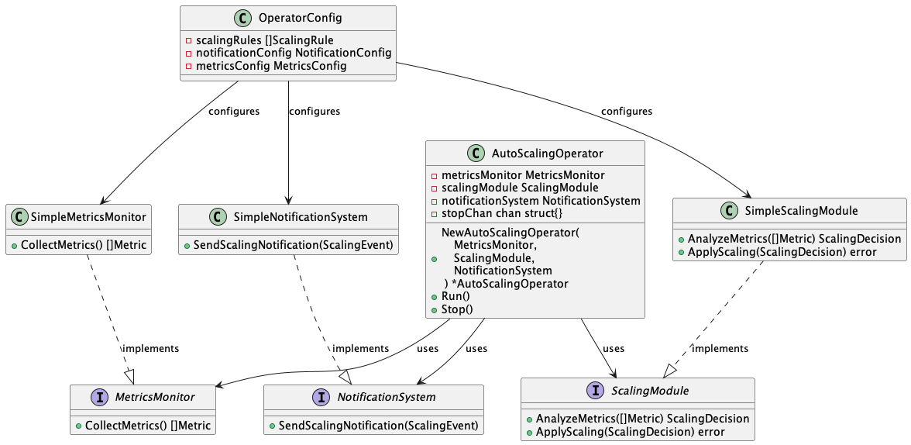
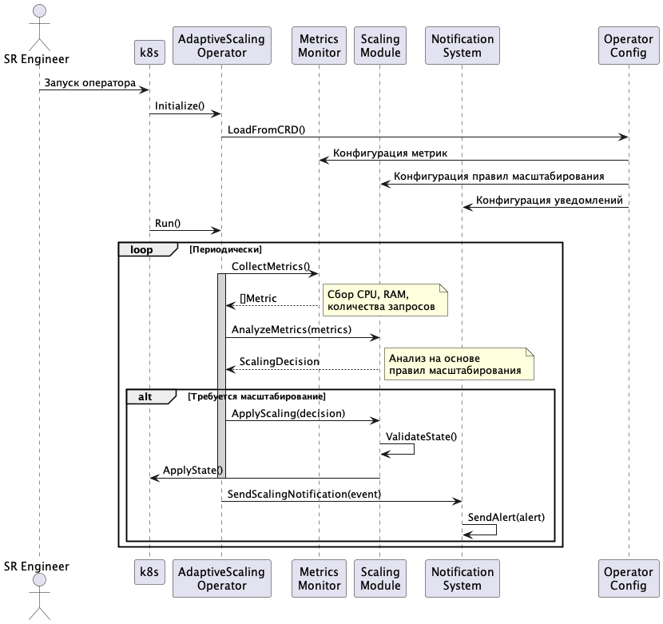

# Выбранный проект: 
### Оператор Kubernetes для адаптивного управления нагрузкой

## Сбор требований

Я провел интервью с потенциальными пользователями — SR-инженерами, которые управляют нагрузкой в Kubernetes-кластерах. Основные проблемы, которые они выделили:

- Ручное масштабирование подов при всплесках трафика
- Медленные или неэффективные механизмы авто-масштабирования
- Отсутствие удобного способа управления правилами авто-масштабирования через CRD
- Проблемы с безопасностью и отказоустойчивостью существующих решений

## Спецификация требований

### 1. Функциональные требования:

- Оператор должен автоматически изменять количество реплик подов при резком увеличении нагрузки
- Поддержка мониторинга метрик (CPU, RAM, количество запросов, пользовательские метрики)
- Возможность настройки правил масштабирования через CRD (Custom Resource Definition)
- Логирование действий оператора для последующего анализа
- Гибкая система уведомлений о масштабировании
- Возможность интеграции с Prometheus/Grafana для визуализации данных

### 2. Нефункциональные требования:

- **Производительность**: Оператор должен обрабатывать 1000+ событий в минуту без деградации
- **Надежность**: Должен быть отказоустойчивым и восстанавливать состояние после перезапуска
- **Безопасность**: Ограниченный доступ к изменению конфигурации, работа в namespace с минимальными правами
- **Масштабируемость**: Поддержка работы в многокластерной среде

## Вывод

Этот проект поможет SR-инженерам автоматизировать управление нагрузкой в Kubernetes, снизив необходимость ручного вмешательства и повысив отказоустойчивость систем. Благодаря использованию CRD, оператор будет гибким и легко адаптируемым под разные сценарии использования.

## Диаграммы

### Диаграмма классов

### Диаграмма последовательности

## Сравнение моделей жизненного цикла разработки

### Водопадная модель (Waterfall)

#### План проекта:
1. Анализ требований (1 неделя)
   - Детальный сбор всех требований к оператору
   - Согласование с заказчиком
   - Утверждение финальной спецификации

2. Проектирование (1 неделя) 
   - Разработка архитектуры
   - Проектирование CRD и компонентов
   - Утверждение дизайн-документации

3. Реализация (3 недели)
   - Разработка всех компонентов
   - Написание тестов
   - Документирование кода

4. Тестирование (2 недели)
   - Модульное тестирование
   - Интеграционное тестирование
   - Нагрузочное тестирование

5. Внедрение (1 неделя)
   - Развертывание в продакшн
   - Обучение пользователей
   - Передача документации

#### Взаимодействие с заказчиком:
- В начале проекта при сборе требований
- После завершения каждого этапа
- При финальной приемке

### Agile модель

#### План проекта:
1. Спринт 1 (2 недели)
   - MVP с базовым автомасштабированием
   - Простой CRD
   - Демо заказчику

2. Спринт 2 (2 недели)
   - Мониторинг метрик
   - Улучшение CRD
   - Базовое логирование

3. Спринт 3 (2 недели)
   - Система уведомлений
   - Интеграция с Prometheus
   - Улучшение производительности

4. Спринт 4 (2 недели)
   - Безопасность
   - Отказоустойчивость
   - Документация

#### Взаимодействие с заказчиком:
- Ежедневные стендапы
- Демо в конце каждого спринта
- Регулярное уточнение требований

### Сравнительный анализ

#### Преимущества Waterfall для проекта:
- Четкое планирование всех этапов
- Детальная документация
- Меньше рисков в критических компонентах
- Проще оценить сроки и бюджет

#### Недостатки Waterfall:
- Низкая гибкость при изменении требований
- Долгое ожидание первых результатов
- Сложно вернуться к предыдущим этапам
- Риски позднего обнаружения проблем

#### Преимущества Agile для проекта:
- Быстрое получение работающего продукта
- Гибкость в изменении требований
- Постоянная обратная связь
- Раннее обнаружение проблем

#### Недостатки Agile:
- Сложнее оценить общие сроки
- Риск технического долга
- Может потребоваться рефакторинг
- Документация может отставать

### Вывод

Для данного проекта более подходящей является **Agile-модель**, так как:
1. Требования могут меняться по мере использования
2. Важна быстрая обратная связь от пользователей
3. Необходимо постоянное тестирование в реальных условиях
4. Технология развивается, могут появляться новые требования

При этом следует уделить особое внимание:
- Тщательному планированию архитектуры
- Документированию API и CRD
- Автоматизации тестирования
- Безопасности при внесении изменений
